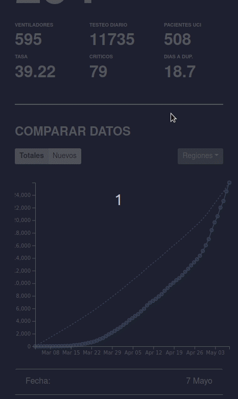
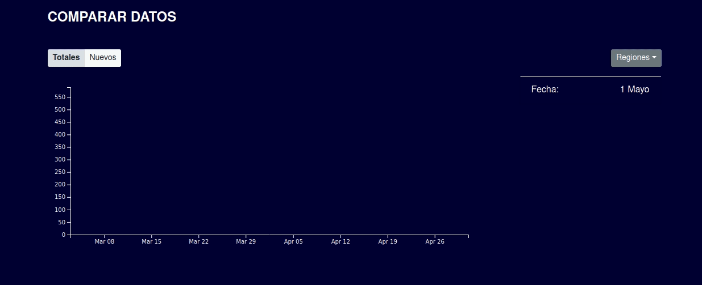

# Dockerized SARS-COV-2 Tracker (Chile)

 

### What do I do?

This is a quick and dirty project I undertook to get familiarized with Docker and data-scraping in Python. The result is a full deployment ready COVID tracker that lives in two docker containers. The chart was built with vanilla D3 - it takes multiple datasets, compares them, re-computes its scales and generators, and animates into the new overall state. Helplines are drawn as the user hovers across these datapoints - the numbers and date on the legend change to reflect the user's position. Datasets can be added and removed dynamically.

The main chart coalesces disparate sources of information into one understandable page. The delta for some measurements is calculated, as well as the mean for others.

### Play with me

```
sudo docker-compose up
```

Will start two services: a nginx server mapped to port 80 of your computer (http://localhost/), along with a Python scraper running a `sched` loop.

Simply open up localhost on a browser and you'll see the page.

### How do I work?

Two Docker containers are fired up by Docker-compose: a `server` container, and a `scraper` container. 

Every 5 minutes, the `scraper` consumes data from the Chilean Ministry of Science's Github repo, where somewhat up-to-date COVID stats are kept. 

The `scraper` and `server` containers share a volume, where the `scraper` writes json files.

The `scraper` is written in Python relying heavily on pandas for data wrangling. The `server` is an nginx process rerouting some URI's to the json files generated by the `scraper`.

The website is built with Vuejs, and compiled to production status using the Vue CLI.


